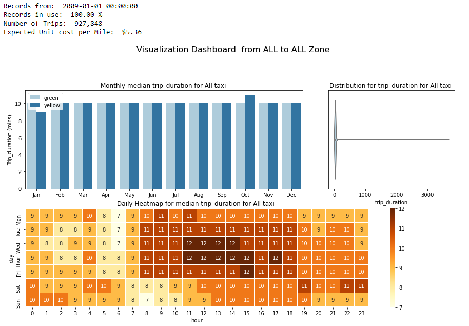

# New York Taxi Visualization Project
## About NY Taxi
The New York City Taxi and Limousine Commission (TLC) was created in 1971. This agency is responsible for licensing and regulating New York City's Medallion (Yellow) taxi cabs, for-hire vehicles (community-based liveries, black cars and luxury limousines), commuter vans, and paratransit vehicles opereate in the city. It is approximated that about one million trips are recorded each day. There are Four types of trips broken down into Yellow Taxi, Green Taxi, For-Hire Vehicle (FHV) and High Volume For-Hire Vehicle (FHVHV). TLC receives taxi trip data from the technology service providers (TSPs) that provide electronic metering in each cab, and FHV trip data from the app, community livery, black car, or luxury limousine company, or base, who dispatched the trip. Visit [About TLC](https://www1.nyc.gov/site/tlc/about/about-tlc.page) for more info. 

## Project Objective
This project was aimed at using the output datasets from the [NY Big Data Analytic Project](https://github.com/MSBGDA/INFO-H-600-Project-Group-AH.git) to developed a visualisation dashboard to help inform tourists to New York on how to maximised the used of the Yellow and Green taxi as their main source of mobility in the city. 
## Repository Content
This repository contains the following :
> - [Data Folder](https://github.com/ivombi/NY-Taxi/tree/main/data): Contains three files, location file (df_loc.csv), yellow(df_y.csv) and green (df_g.csv) sample dataset respectively. They are all embedded in the notebooks.
> - [Dashboard](https://github.com/ivombi/NY-Taxi/blob/main/implementation.ipynb): This notebook implements the NYTaxiViz class and produces the necessary visuals for analysis. 
> - [class](https://github.com/ivombi/NY-Taxi/blob/main/newyorkviz.py):This python file shows the codes used to implement the NYTaxiViz class use in the [Dashboard](https://github.com/ivombi/NY-Taxi/blob/main/implementation.ipynb) notebook
> - [Raw File](https://github.com/ivombi/NY-Taxi/blob/main/visuals.ipynb): This notebook illustrate the complete implementation which was then used to create the [class](https://github.com/ivombi/NY-Taxi/blob/main/newyorkviz.py) file. 
## Implement Locally
To implement this project locally on your personal laptop, you need to [clone ](https://docs.github.com/en/github/creating-cloning-and-archiving-repositories/cloning-a-repository) this repository and run the [Dashboard](https://github.com/ivombi/NY-Taxi/blob/main/implementation.ipynb) notebook. Sample Dashboard Below
 

